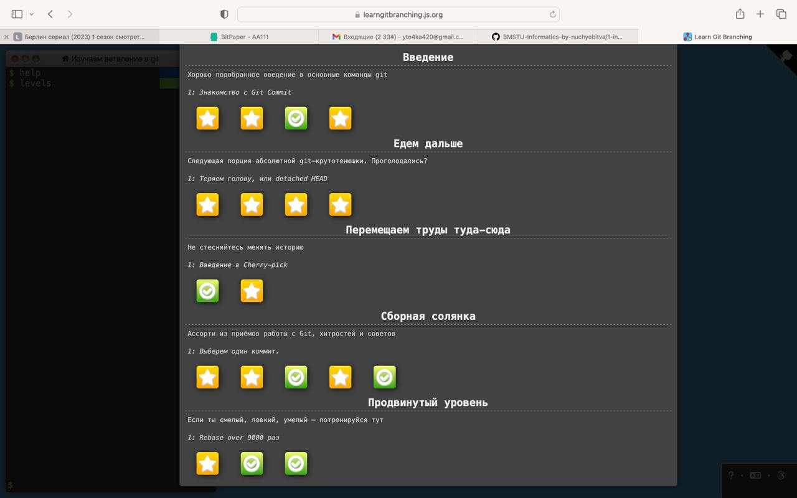

# Семинар 1
1) Удалил текст с данного репозитория
2) [Cсылка на созданный мной репозиторий, со вставленной туда задачей с 1 семестра](https://github.com/dmitrymorin/52)
3) Скрин прохождения обучалки:  
